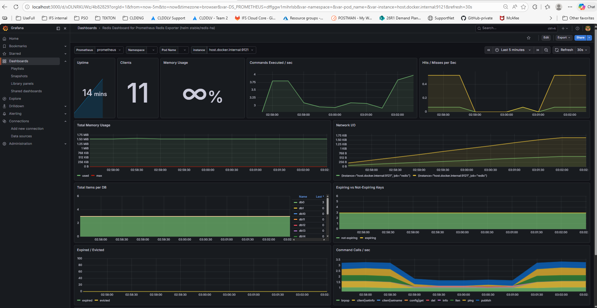

''''
# Start Prometheus
docker run -d -p 9090:9090 prom/prometheus

# Start Grafana
docker run -d -p 3000:3000 grafana/grafana

# Then open:

Prometheus → http://localhost:9090
Grafana → http://localhost:3000 (login: admin / admin)

# In Pwershell
cd C:\Users\sanee\vscode\practical\grafana_prometheous
docker-compose down
docker-compose up -d

# Meanwhile — import Grafana dashboards for what's already working!
Go to Grafana → Dashboards → New → Import
ServiceDashboard IDPostgres9628Redis11835

